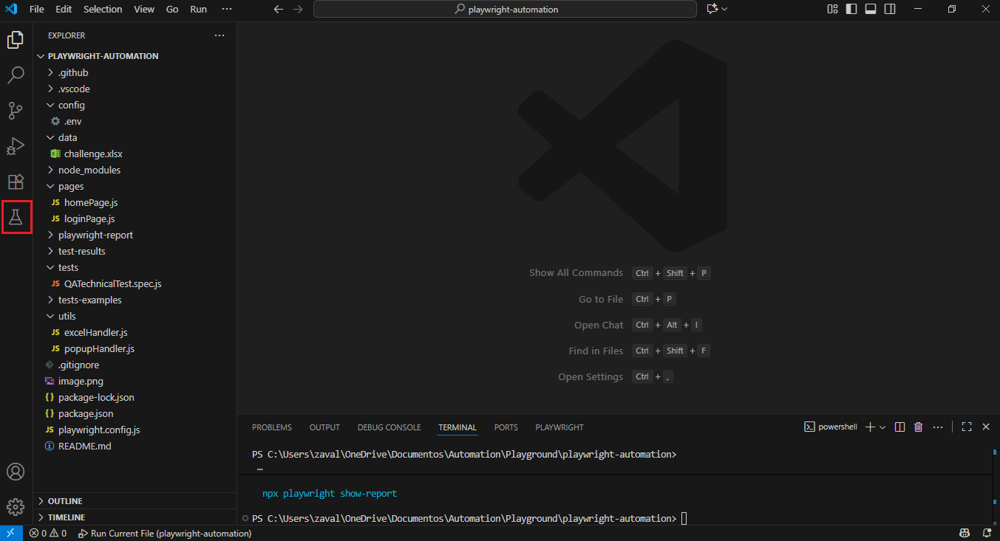
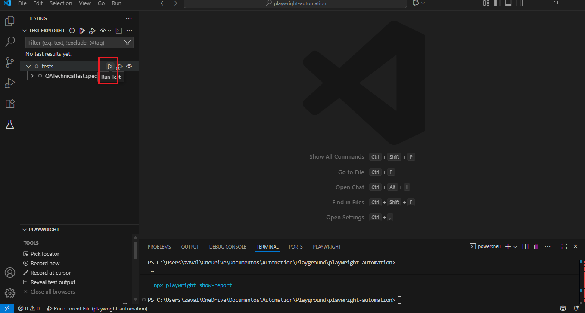

# AUTOMATION SCRIPT

The objective is to Write an automated test for login functionality using a web automation tool (e.g., Selenium, Playwright, or Cypress), any programming language and framework of your choice.

## PROJECT REQUIREMENTS
1. URL: https://the-internet.herokuapp.com/login
2. Valid Credentials:
    - Username: "tomsmith"
    - Password: "SuperSecretPassword!"
3. Create Test Cases for:
    - Valid login
    - Invalid username
    - Invalid password
    - Missing username
    - Missing password
    - Missing username and password
4. Assert on:
    - Success message
    - Error message
    - URL redirection
5. Design Pattern: Page Object Model.
6. Framework: Hybrid (Modular + Data driven)
7. Automation Tool: Playwright
8. Programming language: Javascript
9. Handle waits appropiately.
10. Use clear assertions and error handling.
11. Include a README file.

## PRE-REQUISITES AND DEPENDENCIES 📋
PRE-REQUISITES:
1. Download NodeJS v24.5.2 : https://nodejs.org/es/download
2. Download VS Code: https://code.visualstudio.com/download
3. Download Playwright v1.55.1 (latest version):
    - Open https://playwright.dev/docs/getting-started-vscode and follow the "Getting Started - Installation & Setup" process to install Playwright.

DEPENDENCIES:
1. Install dotenv:
    - In VS Code terminal, run the following command: npm install dotenv --save

## ASSUMPTIONS

1. OS: Windows
2. Google Chrome explorer installed.
3. Windows scripts execution from VS Code Terminal enabled.
4. Git installed

## GETTING STARTED

1. Download GitHub Desktop: https://desktop.github.com/download/
2. Open GitHub Desktop and click on "File/Clone repository
3. Select "URL" and paste: " https://github.com/angelzr4/ZCLabsAutomationScript.git "
4. Choose your local path in which you want to clone the GitHub repository.
5. Click on "Clone". Repository should be clone succesfully into your specified local path.
6. Open VS Code. click on "File/Open Folder and select your local clone directory.

## FOLDER STRUCTURE
├── .API_Testing_Task/           # Part 3 - QA Automation Challenge 
│   └── API Testing Task - Zero Copy Labs.postman_collection.json   #Collection
│   └── API Testing Task - Zero Copy Labs.postman_test_run.json     #Results
│   └── README.md                #Specific for API Testing Task
├── .Spot_the_differences/       # Part 2 - QA Automation Test
│   └── Images_differences.txt   
├── config/                      # Configuration values
│   └── .env
├── data/                        # Data source
│   └── data.js
├── pages/                       # Page Object Models
│   └── homePage.js
│   └── loginPage.js
├── playwright-report/           # Execution HTML Report  (created on runtime)
│   └── index.html
├── tests/                       # Test specs
│   └── CodingTest.spec.js
├── utils/                       # Helper utilities (e.g., Excel reader - optional*)
│   └── excelHandler.js
│
├── playwright.config.ts         # Playwright configuration
├── package.json
├── package-lock.json
├── RunTest_Img.PNG              # Image used in README.md as a reference
├── RunTest_Img2.PNG             # Image used in README.md as a reference
├── ReleaseNotes.txt             # Change history (commit changes)
└── README.md

## EXECUTE TEST

To run the test:
    1. Click on "Testing" icon in the left VS Code bar window: 
    2. Click on "Run Test" icon next to "tests": 
    3. Wait for the execution to be completed.

### ANALIZE TEST REPORT

1. Reports are stored in "playwright-report" project folder.
2. Open using your explorer and analize test results.

## AUTHOR

* **Ángel Zavala Rebollo** - (https://github.com/angelzr4)

## IMPORTANT NOTES!

* **.API Testing Task** and **Spot the difference** folders contain the Part 2 and Part 3 of the QA Automation Test. Please refer to the respective folder for further information.
